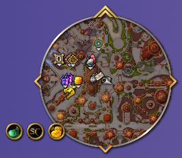

**MinimapButtonBag** cleans up your minimap by tucking all your addon buttons out of sight until you need them.

Instead of a cluttered ring of icons around your minimap, a single icon takes their place.

Addon buttons are removed from the minimap edge and gathered into the bag automatically.

Click the icon to show or hide the button row at any time.

Right-click the icon to open the options panel, where you can exclude specific buttons from the bag and leave them on your minimap as normal.
